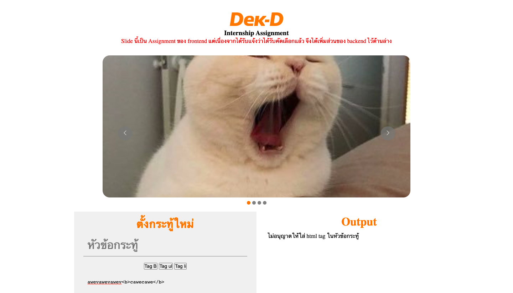

# Dek-D Internship Assignment ( Backend )

## On MacOS

### run this command in this directory

```
php -S 127.0.0.1:8080
```

## On Windows
web -> https://t6tg.github.io/dek-d-intern , branch -> https://github.com/t6tg/dek-d-intern/tree/windows , api -> https://dek-d-t6tg.vercel.app/api เนื่องจากใน windows อาจมีต้องมีการ config ที่อาจทำให้ไม่สามารถ run ได้ จึงแนะนำให้ใช้ วิธีข้างต้น

## File Structure

```
- index.html
- backend
    - sendForm.php
- scripts
    - slide.js
    - form.js
- images
    - 01.jpg
    - 02.jpg
    - 03.jpg
    - 04.jpg
    - logo.png
- styles
    - slide.css
    - form.css
```

## Screenshot



**_Resume ->_** https://t6tg.page.link/dek-d
